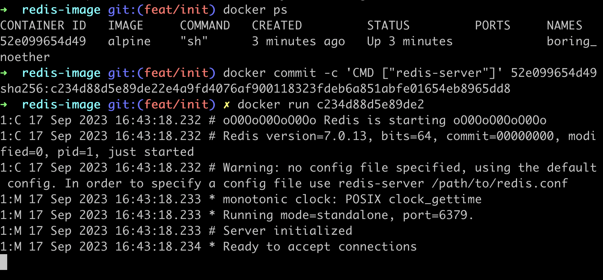

# Commands to Run:

docker build .   => o/p is an image tag

docker run imgtag

Docker uses cache is the series of steps is same.
The commands are rerun from the point where the command changes, so if we introduce any change, we might want to do that as lower in the file as we can

Instead of using docker run imgTag, we can tag our image during build stage like:
    docker build -t dockerId/nameOfRepo:version
eg: docker build -t preetir31/redis:latest .

Manual Img Generation with docker commit
1. Take a image and create a container out of it
docker run -it alpine sh
2. Execute commands/install programs within that container
apk add --update redis

3. Access the running container using docker ps and add a default command to it:
docker commit -c 'CMD ["redis-server"]' 52e099654d49

4. Add a startup command and generate a useful image that can be used in the future

docker run c234d88d5e89de2
runs a container out of the created image

